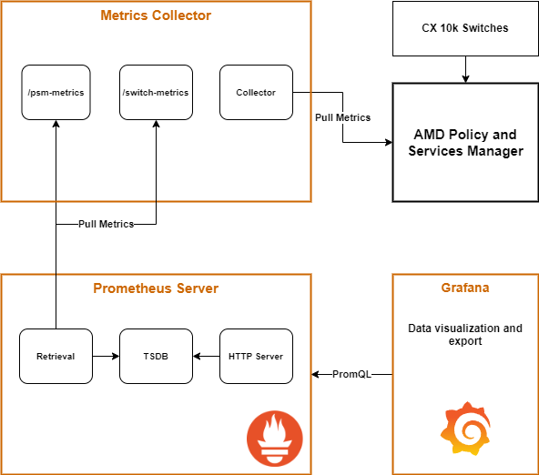
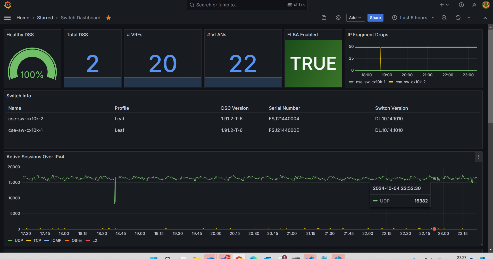
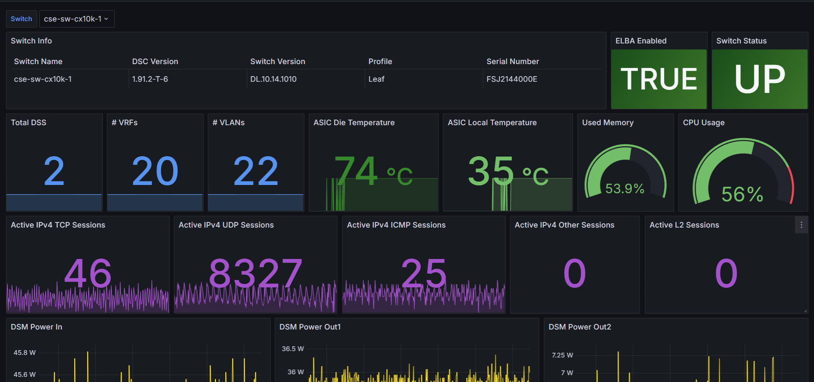
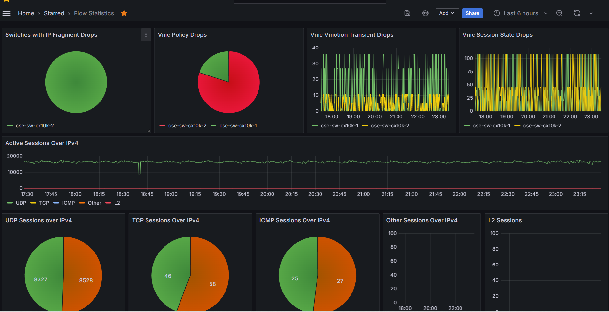

# PSM Metrics Exporter

## Description
This code provides a cookie cutter approach for integrating the PSM metrics with Prometheus and Grafana.  The metrics will be read out of the PSM and put into an OpenTelemetry format and published as an API, so that Prometheus (or other Telemetry tools) can scrape them.

The APIs that will be published are:

| Metric Endpoint | Description | Metrics Captured|
|---|---|---|  
| ```http://<host_ip>:8080/psm-metrics``` | Metrics from the PSM | Cluster, Node
| ```http://<host_ip>:8080/switch-metrics``` | Dataplane and Switch Metrics | PowerMetrics, AsicTemperatureMetrics, LifMetrics, EgressDrops, IngressDrops, FlowStatsSummary, DataPathAssistStats, VnicDrops, MemoryMetrics, AsicCpuMetrics, MacMetrics, IPsecEncryptMetrics, IPsecDecryptMetrics, RuleMetrics

## Architecture
The following diagram shows how metrics are collected from the PSM, and in turn published as metrics APIs, which are scraped by Prometheus, and published as Grafana graphs.  The Metrics are published in OpenTelemetry format and can also be visualized in other observability platforms.  

|  |
|-|  
_Fig. Metrics Architecture_  

  
_Fig. Example Dashboard 1_  

  
_Fig. Example Dashboard 2_  

  
_Fig. Example Dashboard 3_  


## Getting Started  

1. Install Docker (the following instructions should work for Ubuntu 22):  
```console
sudo apt -y remove needrestart
sudo apt install -y apt-transport-https ca-certificates curl software-properties-common
curl -fsSL https://download.docker.com/linux/ubuntu/gpg | sudo gpg --dearmor -o /usr/share/keyrings/docker-archive-keyring.gpg
echo "deb [arch=$(dpkg --print-architecture) signed-by=/usr/share/keyrings/docker-archive-keyring.gpg] https://download.docker.com/linux/ubuntu $(lsb_release -cs) stable" | sudo tee /etc/apt/sources.list.d/docker.list > /dev/null
sudo apt update
sudo apt install -y docker-ce
ME=$(whoami)
sudo usermod -aG docker $ME
```  

2. Install Docker Compose:
```console
mkdir -p ~/.docker/cli-plugins/
curl -SL https://github.com/docker/compose/releases/download/v2.3.3/docker-compose-linux-x86_64 -o ~/.docker/cli-plugins/docker-compose
chmod +x ~/.docker/cli-plugins/docker-compose
```  

3. Clone the repo:

```console
git clone https://github.com/fkhademi/psm-metrics-exporter.git
```

4. Edit docker-compose.yml and edit PSM IP, User and Password:

```console
cd psm-metrics-exporter
vi docker-compose.yml
```

5. Start the Containers:
```console
sudo docker compose up -d
```

## Accessing the Infrastructure

| Service | URL | Description | Internal Port |
|---|---|---|---|
| **Grafana** | ``http://<host_ip>:3000`` | Several dashboards should be available showing control plane and data plane metrics| 3000 |
| **Prometheus** | ``http://<host_ip>:9090`` | Prometheus should be configured to scrape the PSM-Metrics api | 9090 |
| **PSM-Metrics** | ``http://<host_ip>:8080`` | Metrics are scraped from the PSM and published in OpenTelemetry format | 5000 |